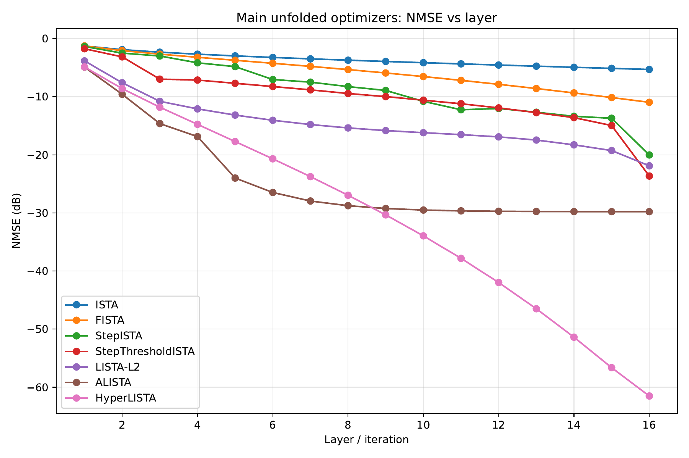
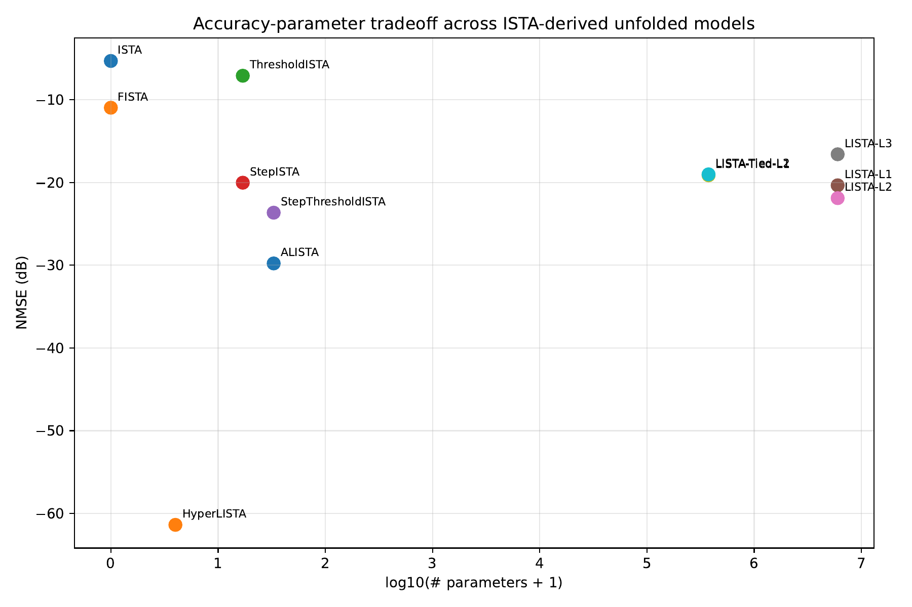
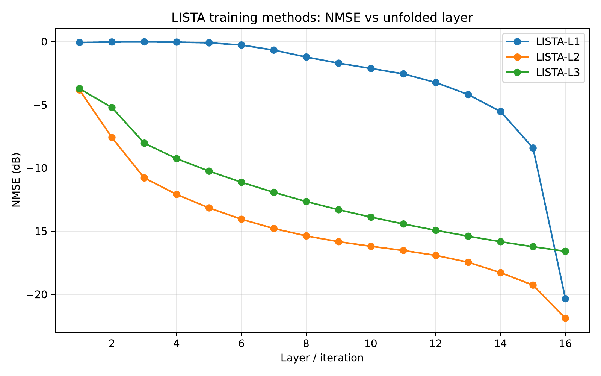
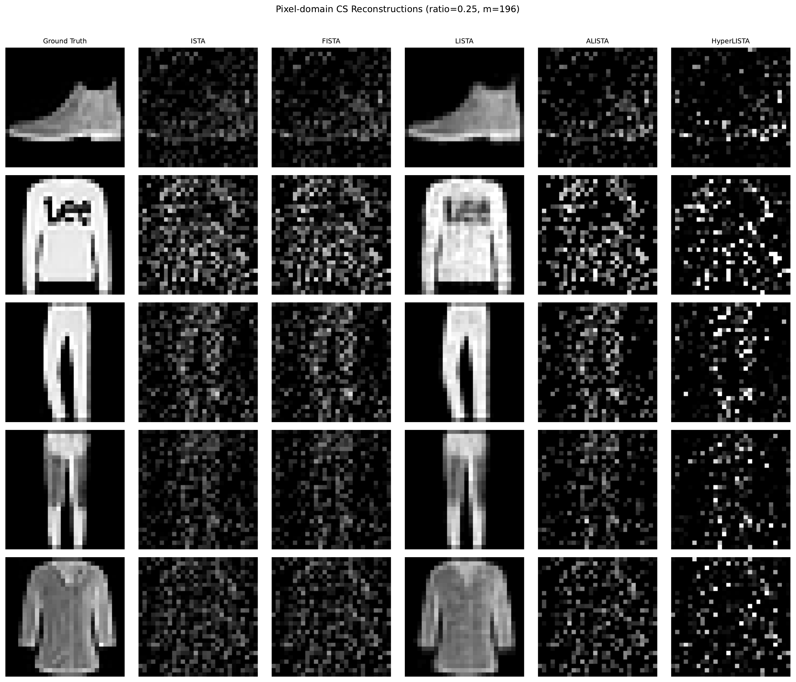

<!-- _class: title -->

# HyperLISTA
## Hyperparameter Tuning is All You Need for LISTA

**Model-Based Deep Learning** · Ben-Gurion University · Spring 2025–2026

*Chen, Liu, Wang, Yin — NeurIPS 2021*

---

# The Problem: Sparse Linear Inverse

**Measurement model:**

$$b = Ax^* + \varepsilon, \qquad x^* \in \mathbb{R}^n \ \text{(s-sparse)}, \quad A \in \mathbb{R}^{m \times n}, \quad m \ll n$$

**Goal:** recover $x^*$ from $b$ when the system is heavily underdetermined.

| | |
|---|---|
| $A \in \mathbb{R}^{250 \times 500}$ | sensing matrix (Gaussian, unit-norm columns) |
| $s = 50$ | sparsity level (10% of entries non-zero) |
| $\varepsilon$ | additive Gaussian noise |

**Applications:** MRI, radar, hyperspectral imaging, compressed sensing

> The key insight: **sparsity is a strong prior** — it makes an underdetermined system tractable.

---

# Classical Iterative Solvers

**ISTA** — Iterative Shrinkage-Thresholding Algorithm:

$$x^{(k+1)} = \mathcal{S}_\theta\!\left(x^{(k)} + \frac{1}{L} A^T(b - Ax^{(k)})\right)$$

**FISTA** — ISTA with Nesterov momentum (convergence $O(1/k^2)$ vs $O(1/k)$):

$$y^{(k)} = x^{(k)} + \frac{t_k - 1}{t_{k+1}}(x^{(k)} - x^{(k-1)}), \qquad x^{(k+1)} = \mathcal{S}_\theta(y^{(k)} + A^T(b - Ay^{(k)}))$$

| Method | NMSE @ K=16 | Learnable params |
|--------|------------|-----------------|
| ISTA | −5.3 dB | 0 |
| FISTA | −11.0 dB | 0 |

**Problem:** Convergence is slow — hundreds of iterations needed for good recovery.
**Idea:** Can we *learn* to converge faster?

---

<!-- _class: divider -->

# From Iteration to Learning
## Deep Unrolling

---

# LISTA — Deep Unrolling of ISTA

**Key idea (Gregor & LeCun, 2010):** Replace fixed $A^T/L$ and $\theta$ with *learned* matrices per layer.

$$x^{(k+1)} = \mathcal{S}_{\theta_k}\!\left(W_x^{(k)} x^{(k)} + W_y^{(k)} b\right)$$

- **$W_x^{(k)}, W_y^{(k)} \in \mathbb{R}^{n \times n}$** — learned per layer (replaces $I - \frac{1}{L}A^TA$ and $\frac{1}{L}A^T$)
- **$\theta_k$** — learned threshold per layer
- Trained end-to-end via BPTT on $(b, x^*)$ pairs

| Method | NMSE @ K=16 | Learnable params |
|--------|------------|-----------------|
| ISTA | −5.3 dB | 0 |
| FISTA | −11.0 dB | 0 |
| **LISTA** | **−22.6 dB** | **~6,000,000** |

> LISTA converges in 16 steps what ISTA needs 1000+ steps for — but at the cost of **6 million parameters**.

---

# The MBDL Progression

**Core question:** Do we need to *learn* everything, or can we build in more structure?

| Model | What's learned | Params | NMSE @K=16 |
|-------|---------------|--------|------------|
| ISTA | nothing | 0 | −5.3 dB |
| FISTA | nothing | 0 | −11.0 dB |
| LISTA | $W_x^{(k)}, W_y^{(k)}, \theta_k$ per layer | ~6 M | −22.6 dB |
| ALISTA | $\gamma_k, \theta_k$ (W analytic) | 32 | −29.8 dB |
| **HyperLISTA** | **$c_1, c_2, c_3$ (grid search)** | **3** | **−61.4 dB** |

**Adding structure $\Rightarrow$ fewer parameters $\Rightarrow$ better performance**

This is the MBDL principle: **the right inductive bias beats raw capacity**.

---

# ALISTA — Analytic Weight Matrix

**Key insight:** The optimal $W$ has a closed-form solution — no need to learn it.

$$W^* = (AA^T + \varepsilon I)^{-1} A, \qquad \text{then normalize so } \mathrm{diag}(W^T A) = \mathbf{1}$$

ALISTA only learns per-layer **step sizes** $\gamma_k$ and **thresholds** $\theta_k$:

$$x^{(k+1)} = \mathcal{S}_{\theta_k}\!\left(x^{(k)} + \gamma_k W^T(b - Ax^{(k)})\right)$$

- From **6M → 32 parameters** (2 scalars × 16 layers)
- Performance improves: −29.8 dB vs −22.6 dB for LISTA

> **Why does removing parameters help?** Fewer degrees of freedom = smoother loss landscape = more stable training.

---

# HyperLISTA — 3 Hyperparameters

**HyperLISTA makes $\theta$, $\beta$, $p$ adaptive to the current iterate** using only 3 scalars:

$$x^{(k+1)} = \mathcal{S}_{p^{(k)},\, \theta^{(k)}}\!\!\left(x^{(k)} + W^T(b - Ax^{(k)}) + \beta^{(k)}(x^{(k)} - x^{(k-1)})\right)$$

$$\theta^{(k)} = c_1 \cdot \mu \cdot \|A^+(Ax^{(k)}-b)\|_1$$

$$\beta^{(k)} = \bigl(c_2 \cdot \mu \cdot \|x^{(k)}\|_0\bigr)_{\leq 0.99}$$

$$p^{(k)} = c_3 \cdot \log\frac{\|A^+b\|_1}{\|A^+(Ax^{(k)}-b)\|_1}$$

$c_1, c_2, c_3$ found by **gradient-free grid search** — no backpropagation at all!

Optimal ranges: $c_1 \in [0.01, 0.2]$, $c_2 \in [0.005, 0.1]$, $c_3 \in [0.5, 30]$

---

# Part A Results — Sparse Recovery

---

# Parameter Efficiency

> **3 parameters outperform 6,000,000** — the power of the right model structure.

---

<!-- _class: divider -->

# Training Strategies
## L1 · L2 · L3

---

# Three Ways to Train an Unfolded Network

**L1 — Standard end-to-end (BPTT):**
$$\mathcal{L} = \|x^{(K)} - x^*\|^2$$

**L2 — Deep supervision (weighted intermediate losses):**
$$\mathcal{L} = \|x^{(K)} - x^*\|^2 + \lambda \sum_{k=1}^{K-1} w_k \|x^{(k)} - x^*\|^2$$

**L3 — Sequential / greedy training:**
Train layer $k$ to minimize $\|x^{(k)} - x^*\|^2$ while layers $1,\ldots,k{-}1$ are **frozen**.

---

# Training Methods Results

---

# Training Methods — Key Findings

| Method | NMSE @ K=16 | Params | |
|--------|------------|--------|--|
| LISTA-L1 | −12.6 dB | 6,000,016 | Baseline |
| LISTA-L2 | −13.4 dB | 6,000,016 | +0.8 dB from deep supervision |
| LISTA-L3 | −12.1 dB | 6,000,016 | Plateaus after layer 5 |
| **LISTA-Tied-L1** | **−17.1 dB** | **375,001** | Beats independent LISTA |
| LISTA-Tied-L2 | −16.7 dB | 375,001 | — |
| ALISTA | −30.0 dB | 32 | Reference |
| HyperLISTA | −54.1 dB | 3 | Reference |

**LISTA-Tied beats LISTA-Independent by 4.5 dB with 16× fewer parameters.**

Weight tying = implicit regularization: shared $(W_y, W_x, \theta)$ smooths the loss landscape and improves gradient flow. Another MBDL lesson: **structural constraints can be more valuable than extra capacity**.

**L3 observation:** NMSE flattens from layer 5 onward — greedy training has no incentive to improve beyond what previous layers already achieved.

---

<!-- _class: divider -->

# Part B — Image Reconstruction
## FashionMNIST Compressed Sensing

---

# Compressed Sensing on Images

**Pixel-domain CS** (no frequency transform needed):

$$b = Ax + n, \qquad x \in [0,1]^{784}$$

FashionMNIST has a black background → pixels are **~51.5% exactly zero** (soft-sparse in pixel space).

Measurement ratios tested: $m/d \in \{0.125,\ 0.25,\ 0.5\}$

Metrics: **NMSE**, **PSNR**, **SSIM**

| Method | NMSE (ratio=0.25) | PSNR | SSIM |
|--------|------------------|------|------|
| ISTA | −1.9 dB | 8.8 | 0.134 |
| FISTA | −1.8 dB | 8.7 | 0.135 |
| **LISTA** | **−14.6 dB** | **23.2** | **0.863** |
| ALISTA | −1.6 dB | 8.4 | 0.128 |
| HyperLISTA | −0.9 dB | 7.7 | 0.091 |

---

# Part B — Visual Results (ratio = 0.25)

---

# The Unexpected Winner: LISTA

**Why does LISTA win on images while ALISTA/HyperLISTA fail?**

ALISTA and HyperLISTA assume **i.i.d. Gaussian sparse signals**:
$$x^* \text{ has exactly } s \text{ non-zero entries drawn from } \mathcal{N}(0,1)$$

FashionMNIST pixels are **bounded** $[0,1]$, **spatially smooth**, and only *soft-sparse*.

HyperLISTA's adaptive threshold:
$$\theta^{(k)} = c_1 \cdot \mu \cdot \|A^+(Ax^{(k)}-b)\|_1$$
...calibrates to residuals under a Gaussian sparse model. On real images the residual reflects **spatial structure**, not sparse noise → valid signal gets zeroed out.

> **MBDL lesson: the wrong inductive bias is worse than no bias at all.**
> LISTA is data-driven — it learns the actual image distribution from 51K training samples and wins precisely because it makes fewer assumptions.

---

# Conclusions

**The MBDL hierarchy in action:**

| More structure → | Fewer parameters → | Better performance |
|-----------------|-------------------|-------------------|
| LISTA | 6,000,000 | −22.6 dB |
| ALISTA | 32 | −29.8 dB |
| HyperLISTA | **3** | **−61.4 dB** |

**Key takeaways:**

1. **Structured models beat black-box learners** — when the model assumptions match the data.
2. **Weight tying is implicit regularization** — LISTA-Tied outperforms LISTA-Independent with 16× fewer parameters.
3. **The right prior matters** — ALISTA/HyperLISTA fail on images because the Gaussian sparse assumption is wrong for natural images. LISTA wins by being assumption-free.
4. **Zero backprop can outperform full training** — HyperLISTA's 3 scalars via grid search beat 6M learned parameters by 39 dB.

---

<!-- _class: title -->

# Thank You

**HyperLISTA Project**
Model-Based Deep Learning · Ben-Gurion University

*Chen, Liu, Wang, Yin — "Hyperparameter Tuning is All You Need for LISTA" · NeurIPS 2021*

`github.com/ThEpiCake/hyperlista-mbdl`
